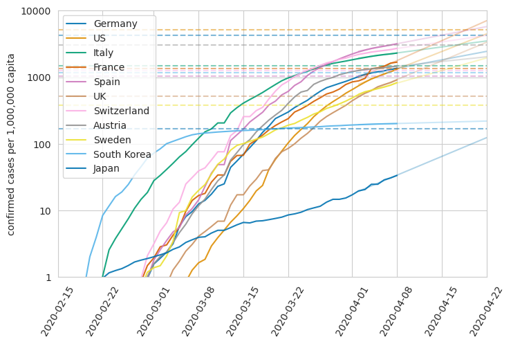
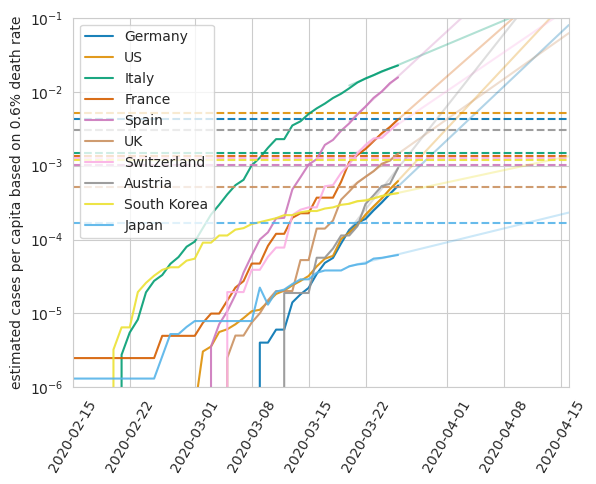
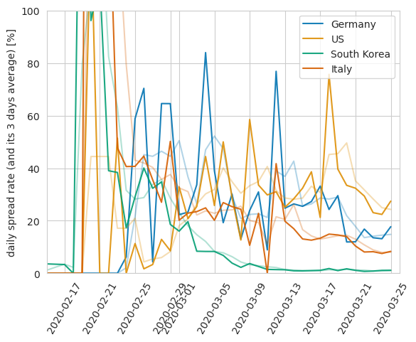
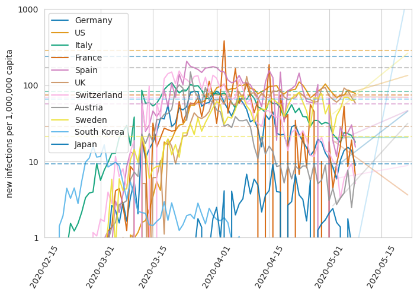

# kovid

Some custom data analysis on COVID-19 data.

**Please don't interpret/spread/use/publish these plots without fully understanding them!!!**

## Why?
Data that is currently being distributed by news papers and info charts mostly shows absolute numbers, which I find not very helpful for comparing different countries. Also it usually does not include critical numbers such as the hospital capacities and so on.

## How?
The folder contains an `update.sh` script that clones/pulls from the [CSSE](https://github.com/CSSEGISandData/COVID-19.git) repository. It then calls a python script that reads the current data and generates some plots into the `png` folder.

## What?
Three plots are generated:
- confirmed cases per capita
- estimated cases per capita based on the deaths per capita
- spread rate

### confirmed cases per capita

This is the number of registered confirmed cases divided by the population size. This number is suspected to lag around 7 - 9 days behind the actual infections because the average incubation period is 5 days and there is a 2 - 4 days delay for testing and registration. Since the growth rate for most countries with an exponential outbreak is currently around 30%, this number can be multiplied by approximately 10 to get an estimate of the actual number of currently infected people.

The dashed lines indicate **very rough estimates** of the maximum ICU capacities for COVID-19 patients in each country. It is based on the country-specific default ICU capacities that are gathered from these sources:
- https://link.springer.com/article/10.1007/s00134-012-2627-8
- https://link.springer.com/article/10.1007/s00134-015-4165-7
- https://en.wikipedia.org/wiki/List_of_countries_by_hospital_beds#Numbers

To get the COVID-19 capacities, an absolute minimum ICU capacity for non-Corona patients of 3.5 ICUs per 100,000 gets subtracted. This is a best-guess number that seems somehow reasonable to me since some countries can maintain a good-ish health system with only 4.5 ICUs per 100000 (e.g. Japan, Portugal).
Moreover, approximately 6% of the known COVID-19 infected require ICU treatment.

E.g. Germany has 29.2 ICUs per 100,000 people. Therefore, these are only 29.2 - 3.5 = 25.7 ICUs for the Corona patients. Thus, 25.7/100,000/0.06 ~ 0.4% of the population can maximally become sick simultaneously.

### estimated cases per capita based on the deaths per capita

The number of deaths per country is considered to be more reliable than the number of positive test results because
1. not everyone who is infected can be tested
2. on the other hand, deaths are usually registered
3. countries have largely varying test capacities which is directly reflected in the large variation of average death rates per country

In order to compare different countries, I found it therefore reasonable to estimate the number of actual cases based on the _death rate_ that is found in the countries with the largest test capacities: Germany and South Korea. Here, we have seen approximately 0.2% during exponential growth.

**Note that this estimate only holds true during the exponential growth phase!** This is because the death rate reflects the number people that died from infections that happened a few days earlier. To understand this, assume that the spread would suddenly stop, i.e. the number of new infections would suddenly be zero. The number of deaths would then still increase because people were already sick. Thus, 0.2% is not the true death rate of COVID-19 but only the fraction of the current number of deaths in relation to the currently registered cases during the exponential phase.

### spread rate

This is the number of newly registered infections divided by the number of confirmed infections from the day before. It contains less countries than the other plots for clearness.

### daily infected

This is the number of daily registered new infections divided by the population size. The dashed lines here indicate a health system capacity estimate based on
- 6% ICU treatment rate for confirmed COVID-19 patients
- 18 days ICU care for each of these patients
- absolute minimum ICU capacity for non-COVID-19 patients of 3.5 ICUs/100,000 (see above)
This plot is inspired by [this video by Harald Lesch](https://www.youtube.com/watch?v=Fx11Y4xjDwA).
